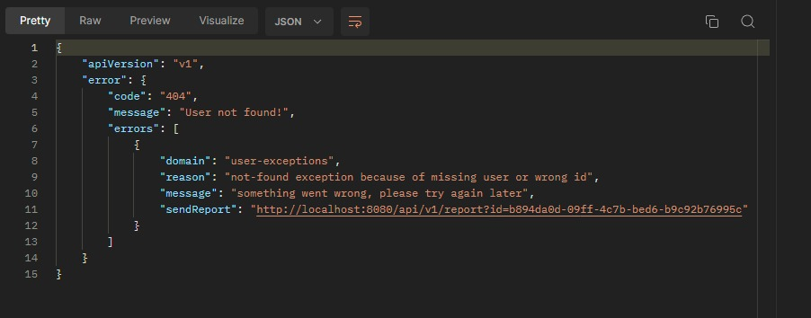
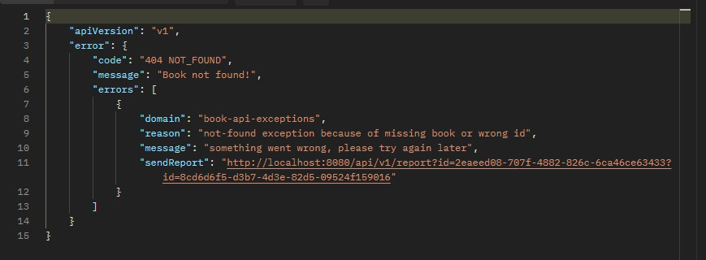
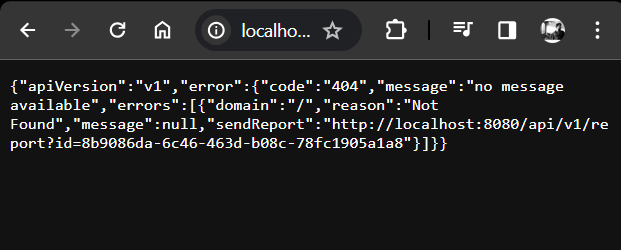

# Microservices and Exception Handling

#### This is a simple project to demonstrate how to handle exceptions with Google Error Format and expose exceptions which is thrown by other microservice.


## Exception Before Custom Exception Handler

```json
{
  "timestamp": "2021-08-08T15:03:05.000+00:00",
  "status": 500,
  "error": "Internal Server Error",
  "path": "/api/v1/employees/1"
}
``` 

## What is this Google Format Exception

```json
{
  "apiVersion": "2.0",
  "error": {
    "code": 404,
    "message": "File Not Found",
    "errors": [{
      "domain": "Calendar",
      "reason": "ResourceNotFoundException",
      "message": "File Not Found"
    }]
  }
}
```
Indicates that an error has occurred, with details about the error. The error format supports either one or more errors returned from the service. A JSON response should contain either a data object or an error object, but not both. If both data and error are present, the error object takes precedence.

- [Google Error Docs](https://developers.google.com/drive/api/v3/handle-errors)
- [Google Error Docs from GitHub](https://google.github.io/styleguide/jsoncstyleguide.xml?showone=error#error)

## Other problem is text/html response

When someone try to access the endpoint with browser, it will return text/html response. If thrown exception is not handled, it will return White Label Error Page with 500 status code.
This is not good for API. We need to return JSON response with correct status code.
We have to customize AbstractErrorController to handle this problem.

## Outputs

<details>

<summary>User Exception</summary>



</details>

<details>

<summary>Book Exception from User Service</summary>



</details>

<details>

<summary>Exception from Browser</summary>



</details>


## References


[thepracticaldeveloper](https://thepracticaldeveloper.com/custom-error-handling-rest-controllers-spring-boot/)
[baeldung - Custom Error Page](https://www.baeldung.com/spring-boot-custom-error-page)
[bealdung - Feign Client Exception Handling](https://www.baeldung.com/java-feign-client-exception-handling)

